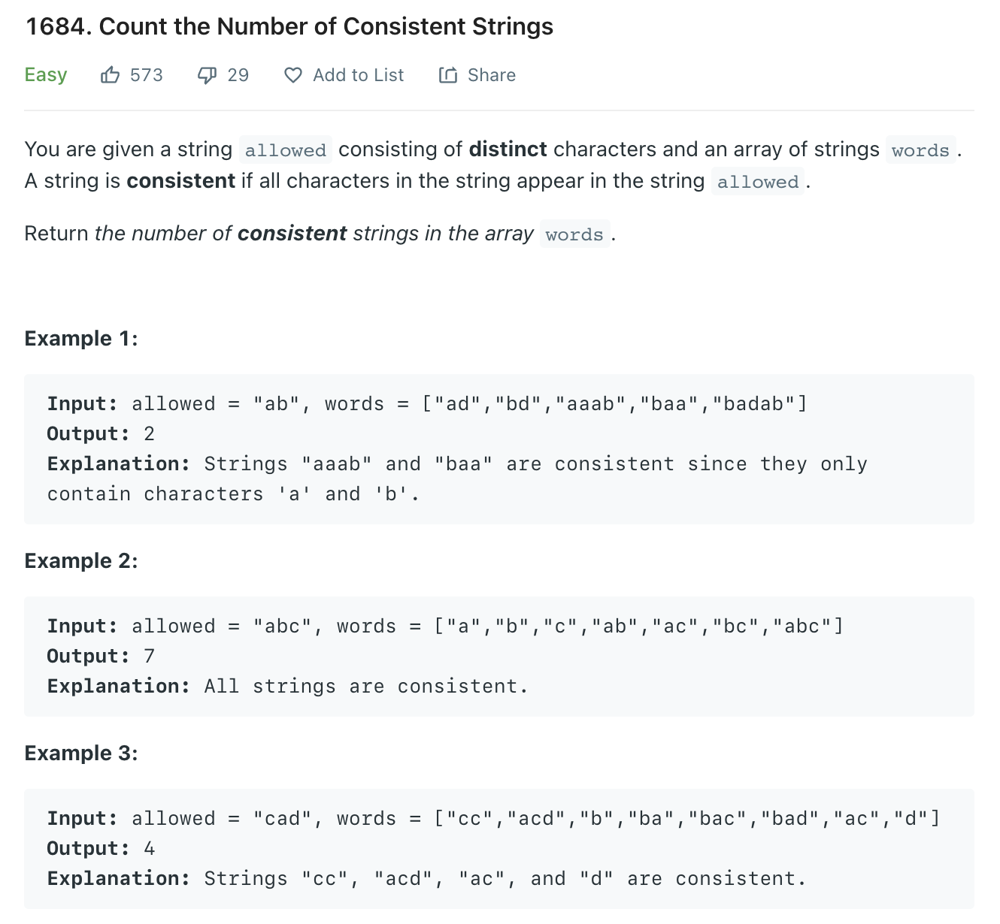

# 1684. Count the Number of Consistent Strings



```javascript
/**
 * @param {string} allowed
 * @param {string[]} words
 * @return {number}
 */
var countConsistentStrings = function(allowed, words) {
    let ans = 0
    words.forEach(word => {
        allowed.split('').forEach(keyword => {
            word = word.replace(new RegExp(keyword, 'g'), "");
        })
        if (word.length === 0) ans++
    })
    return ans
};
```
